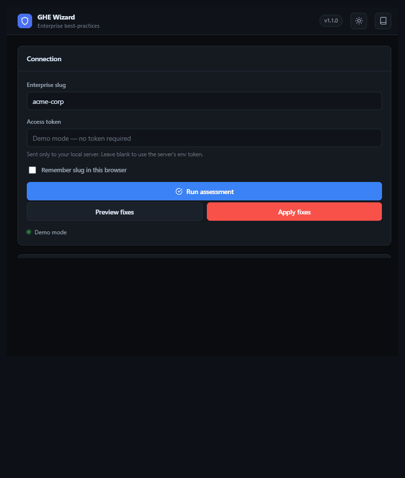
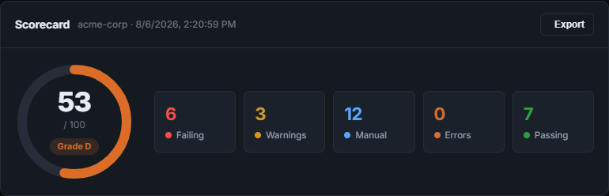
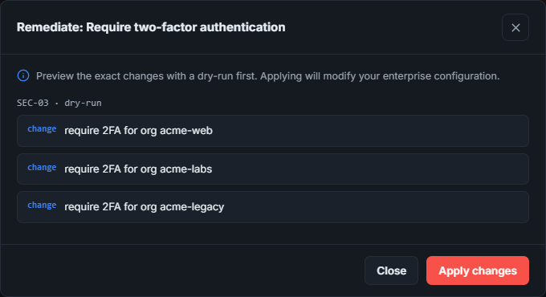

# ghe-wizard — GitHub Enterprise Best-Practices Wizard

[](https://github.com/heisenberg-alt/ghe-wizard/actions/workflows/ci.yml)
[](https://go.dev)
[](LICENSE)
[](https://github.com/heisenberg-alt/ghe-wizard/releases)

An automated **assess → modify → implement** tool for customers adopting **GitHub
Enterprise Cloud**. It scans an enterprise account against GitHub's recommended
best practices, produces a scorecard, and can remediate the fixable findings —
available as both an **interactive CLI wizard** and a **web dashboard**.

The rule catalog is distilled from GitHub's official
[Enterprise onboarding](https://docs.github.com/en/enterprise-cloud@latest/enterprise-onboarding)
and [Best practices for enterprises](https://docs.github.com/en/enterprise-cloud@latest/admin/concepts/enterprise-best-practices)
documentation.

<p align="center">
  
</p>

> **Try it in 10 seconds — no GitHub token required:**
> ```bash
> go run ./cmd/ghe-wizard serve --demo   # then open http://localhost:8080
> ```
> Demo mode runs the real assessment engine against a realistic synthetic
> enterprise so you can explore the scorecard and remediation flow instantly.


## What it checks (28 rules, 9 domains)

| Domain | Examples |
|---|---|
| Enterprise foundations | limit enterprise owners, least-privilege custom roles |
| Organizations | intentional org creation, stale-org cleanup, least-privilege base permission |
| Teams | manage access via teams, IdP sync, restrict membership control |
| Repositories | org-owned collaboration, custom properties, repo-creation controls |
| Policies | branch rulesets, IP allow list, Copilot policies, read-only workflow token |
| Security | enterprise SSO, SCIM, 2FA, audit-log streaming, secret scanning |
| Innersource | internal-visibility repos for discovery & reuse |
| Automation | GitHub Apps over PATs, automated provisioning |
| Billing | cost centers, spending limits |

Run `ghe-wizard list` for the full catalog. Rules marked `[remediable]` can be
applied automatically.

## Install / build

Download a prebuilt binary from the [Releases](https://github.com/heisenberg-alt/ghe-wizard/releases)
page (Linux/macOS/Windows, amd64/arm64), or build from source:

```bash
go build -o ghe-wizard ./cmd/ghe-wizard
```

### Docker

A container image is published to GitHub Container Registry:

```bash
docker run --rm -p 8080:8080 \
  -e GHE_ENTERPRISE=octo-enterprise \
  -e GHE_TOKEN=ghp_xxx \
  ghcr.io/heisenberg-alt/ghe-wizard:latest
# then open http://localhost:8080

# or run the CLI
docker run --rm -e GHE_ENTERPRISE=octo-enterprise -e GHE_TOKEN=ghp_xxx \
  ghcr.io/heisenberg-alt/ghe-wizard:latest assess
```

## Authentication

Set a Personal Access Token with enterprise admin scopes and your enterprise slug:

```bash
export GHE_TOKEN=ghp_xxx          # or GITHUB_TOKEN
export GHE_ENTERPRISE=octo-enterprise
```

> A GitHub App token provider can be added later; the client is designed for it.

## Usage

```bash
# Read-only assessment (Markdown scorecard)
ghe-wizard assess

# JSON or self-contained HTML report to a file
ghe-wizard assess --format json --out scorecard.json
ghe-wizard assess --format html --out scorecard.html

# Interactive wizard: walk failing rules and remediate with confirmation
ghe-wizard wizard

# Preview all remediations without changing anything
ghe-wizard apply --dry-run

# Apply specific fixes
ghe-wizard apply --rules ORG-04,SEC-03

# Web dashboard
ghe-wizard serve --addr :8080

# Try everything with no token (synthetic data)
ghe-wizard assess --demo
ghe-wizard serve --demo

# Print version / list the catalog
ghe-wizard version
ghe-wizard list
```

### Use in CI

`--fail-on` makes the assessment gate a pipeline. Combine with `--no-preflight`
when using a fine-grained token.

```bash
ghe-wizard assess --format json --out scorecard.json --fail-on fail
# exit code is non-zero if any check is failing
```

### Secure the dashboard

The dashboard sets strict security headers and supports optional HTTP basic auth.
Keep it on localhost, or put it behind a TLS-terminating proxy:

```bash
GHE_BASIC_PASS=s3cret ghe-wizard serve --basic-user admin
```

## Screenshots

| Scorecard | Findings & remediation |
|---|---|
|  |  |

## Safety model

- `assess` is strictly read-only.
- `apply` defaults to prompting for confirmation; `--dry-run` describes changes only.
- Remediations are idempotent (they re-check current state before acting).
- Findings that cannot be determined from the API are reported as **manual review**
  rather than guessed.

## Configuration

Optional JSON config (`--config config.json`) tunes thresholds:

```json
{
  "base_url": "https://api.github.com",
  "graphql_url": "https://api.github.com/graphql",
  "max_orgs": 0,
  "thresholds": { "max_enterprise_owners": 5, "stale_org_days": 180 }
}
```

Environment variables (`GHE_ENTERPRISE`, `GHE_TOKEN`/`GITHUB_TOKEN`,
`GHE_BASE_URL`, `GHE_GRAPHQL_URL`) override file values.

## Project layout

```
cmd/ghe-wizard/      CLI entrypoint (assess | wizard | apply | report | serve | list)
internal/ghclient/   GitHub REST+GraphQL client (PAT auth, pagination, rate limits)
internal/rules/      Rule interface, registry, function-backed Base helper
internal/rules/catalog/  Best-practice rules, one file per domain
internal/engine/     Runs rules, aggregates scorecard, runs remediations
internal/report/     JSON / Markdown reporters
internal/web/        HTTP JSON API + embedded dashboard UI
internal/config/     Config + thresholds loading
```

## Extending the catalog

Add a rule by registering a `rules.Base` in an `init()` inside
`internal/rules/catalog/`. Provide `AssessFn` and, when automatable, a
`RemediateFn`. It is picked up automatically by the CLI and web server.

## Contributing

Contributions are welcome. CI (build, `go vet`, and race-enabled tests) runs on
every pull request via [GitHub Actions](.github/workflows/ci.yml). Please keep the
assessment path read-only and ensure remediations remain idempotent and dry-runnable.

## License

Released under the [MIT License](LICENSE).
